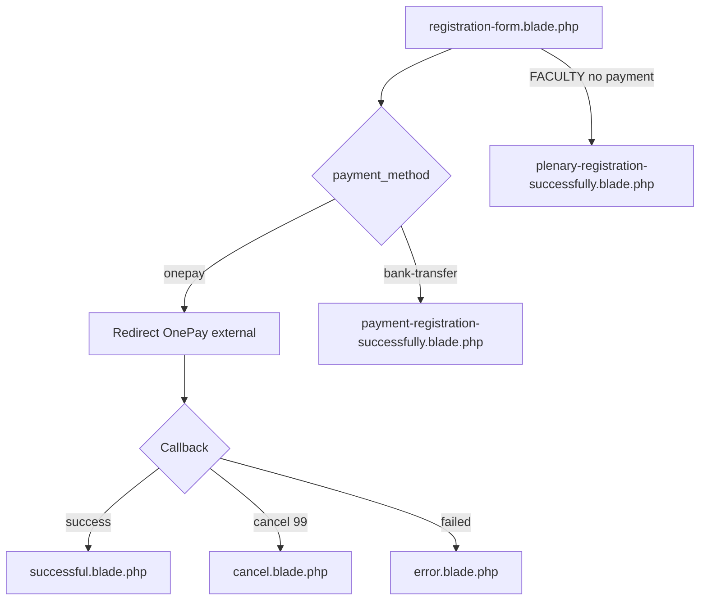

# View & Style — Luồng đăng ký VSIR2026

> Tài liệu bổ sung cho [`LUONG-DANG-KY-VSIR2026.md`](./LUONG-DANG-KY-VSIR2026.md)  
> Mục đích: mô tả **toàn bộ giao diện** (Blade, CSS inline, JS, assets) để copy sang dự án khác.

---

## 1. Danh sách view & route

| Route name | URL | View file | Khi nào hiển thị |
|------------|-----|-----------|------------------|
| `registration.info` | `registration.html` | `registration-info.blade.php` | Trang thông báo đăng ký đóng |
| `registration.form` | `registration-form.html` | `registration-form.blade.php` | **Form đăng ký chính** |
| `payment.registration.submit` | POST | — | Xử lý submit (không có view) |
| — | `register-here.html` | `registration-page.blade.php` | Legacy: chọn quốc gia (dùng `registration.js`) |
| — | — | `partials/payment-registration-successfully.blade.php` | Sau submit **bank transfer** |
| — | — | `partials/plenary-registration-successfully.blade.php` | Faculty/Invited (không thanh toán) |
| `registration.successful` | `registration/success` | `partials/successful.blade.php` | Callback OnePay **thành công** |
| `registration.cancel` | `registration/cancel` | `partials/cancel.blade.php` | Callback OnePay **hủy** |
| `registration.error` | `registration/error` | `partials/error.blade.php` | Callback OnePay **thất bại** |
| — | — | `email/registration-template.blade.php` | Wrapper HTML email (local/test) |

**Partial legacy (form cũ đa category — chưa dùng trong form VSIR2026 mới):**

| File | Mô tả |
|------|-------|
| `partials/table/local_registration_table.blade.php` | Bảng phí VN early/regular, checkbox + `conferenceFees()` |
| `partials/table/international_registration_table.blade.php` | Bảng phí quốc tế USD, gala dinner |
| `assets/js/registration.js` | JS cho form legacy (category LOCAL/INTERNATIONAL/FACULTY) |

---

## 2. Layout cha & dependencies

Tất cả view đăng ký đều:

```blade
@extends('theme::layouts.master')
@section('content')
  ...
@endsection
```

**File layout:** `Themes/apscvir2025v2/views/layouts/master.blade.php`

### CSS global theme (load sẵn trên mọi trang)

```
themes/css/slick.css
themes/css/jquery-ui.css
themes/css/common.css
themes/css/custom.css
themes/css/responsive.css
{!! Assets::css() !!}   ← CSS đăng ký qua controller
```

### JS global theme

```
jquery.js, slick, bxSlider, jquery-ui, common.js, developer.js
@stack('header')       ← reCAPTCHA script push từ registration-form
@stack('styles')
```

### Class grid legacy (dùng ở trang success bank transfer)

Các class từ theme cũ vẫn xuất hiện:

```
.grid, .s-12, .m-12, .l-7, .center, .padding-2x
.text-strong, .text-dark, .text-size-60, .text-uppercase, .margin-bottom-20
.button, .background-white
```

**Port:** Có thể bỏ grid cũ, thay bằng flexbox thuần như các trang `payment-result-*`.

### Biến Blade dùng chung

```php
// Đa số view đăng ký
$currentLocale = \Session::get('frontend-locale', app()->getLocale());
$isEnglish = $currentLocale == 'en';

// Trang success bank transfer
$guestCode = $registration->guest_code ?? $guest_code ?? '';
```

---

## 3. Design system (màu & typography)

| Token | Giá trị | Dùng ở |
|-------|---------|--------|
| Primary blue | `#005696` | Tiêu đề section, nút submit, link, border note-box |
| Primary hover | `#004080` | Hover nút / file upload |
| Success green | `#28a745` / nền `#d4edda` | Icon + title trang thanh toán OK |
| Warning amber | `#ffc107` / nền `#fff3cd` / chữ `#856404` | Notice đóng đăng ký, cancel payment |
| Error red | `#dc3545` / nền `#fee` | Trang thanh toán lỗi |
| Cancel orange | `#ff9800` | Icon hủy thanh toán |
| Border neutral | `#ddd` | Input, table, card |
| Text body | `#333` / `#666` | Nội dung |
| Card shadow | `0 4px 20px rgba(0,0,0,0.1)` | Kết quả thanh toán |
| Required marker | `sup { color: red }` | Field bắt buộc |

**Font:** Kế thừa từ theme (`common.css`). Form đăng ký không set font riêng — `font-size: 14px` trên `.form-control`.

**Max width chuẩn:**

| Container | max-width |
|-----------|-----------|
| Form đăng ký | `1000px` |
| Notice / payment result | `800px` |
| Bank transfer box | `900px` |
| Registration info | `1200px` (wrapper), notice `800px` |

---

## 4. View chính: `registration-form.blade.php`

**Path:** `Themes/apscvir2025v2/views/registration-form.blade.php`  
**Route:** `GET registration-form.html` → `Apscvir2025v2Controller@registration`

### 4.1. Cấu trúc trang

```
layouts.master
└── .form-container (min-height: 72.5vh)
    ├── [EN] .notice-message only
    └── [VI] <form id="payment-registration">
            ├── .form-section — Thông tin chung
            ├── .form-section — Ăn kiêng
            ├── .form-section#fee_section_early — Bảng phí
            ├── .form-section — Phương thức thanh toán
            ├── hidden: category, country, total_amount
            ├── g-recaptcha (nếu có GOOGLE_RECAPTCHA_KEY)
            ├── button.submit-button
            └── <script> inline JS tính phí
```

### 4.2. Form attributes (bắt buộc khi port)

```html
<form action="{{ route('payment.registration.submit') }}"
      id="payment-registration"
      method="POST"
      enctype="multipart/form-data">
  @csrf
```

### 4.3. Section — Thông tin chung

| Field `name` | Type | Required | Ghi chú UI |
|--------------|------|----------|------------|
| `title` | radio | ✓ | GS.TS., PGS.TS., TS., BSCKI., BSCKII., BS., `other` |
| `titleOther` | text | if other | `#titleOther`, class `other-input`, disabled mặc định |
| `fullname` | text | ✓ | class `form-control` |
| `affiliation` | text | ✓ | |
| `position` | text | | |
| `day`, `month`, `year` | select | ✓ | wrapper `.date-group` flex 3 cột |
| `phone` | tel | ✓ | |
| `email` | email | ✓ | |
| `degree_file` | file | ✓ | Hidden input + label `.file-upload-label` "Tải file" |

**Pattern upload file:**

```html
<label for="degree_file" class="file-upload-label">Tải file</label>
<input type="file" id="degree_file" name="degree_file"
       accept=".pdf,.jpg,.jpeg,.png" required style="display:none">
<span id="degree_file_name"></span>
```

CSS: `input[type="file"] { display: none; }` — click label để mở dialog.

### 4.4. Section — Ăn kiêng

| `name` | Values |
|--------|--------|
| `dietary` | `Không có`, `Ăn chay`, `other` |
| `dietaryOther` | text khi chọn other |

### 4.5. Section — Bảng phí (`#fee_section_early`)

**Cấu trúc table:** class `fee-table`

| value (`conference_checklist_item`) | Label | `data-fee-amount` |
|-------------------------------------|-------|-------------------|
| `vsir_member` | Bác sĩ (thành viên VSIR) | 2500000 |
| `non_vsir_member` | Bác sĩ (không phải thành viên VSIR) | 3000000 |
| `medical_staff` | Nhân viên hỗ trợ y tế | 1500000 |
| `poster_oral_speaker` | Báo cáo viên Poster, Oral | 0 |

**Gala Dinner:** checkbox `galadinner_fee` value=`1000000`, `data-fee-type="early"`

**Tổng:** `#total_early` hiển thị, `#total_amount` hidden gửi server

**UX:** Click cả `<tr>` để chọn radio:

```html
<tr onclick="document.getElementById('conference_checklist_item_vsir_member').click();">
```

### 4.6. Section — Thanh toán

| `payment_method` | Label |
|------------------|-------|
| `onepay` | Online + ghi chú 6% phí |
| `bank-transfer` | Chuyển khoản + `.note-box` thông tin MB Bank |

### 4.7. reCAPTCHA

```blade
@push('header')
<script src="https://www.google.com/recaptcha/api.js" async defer></script>
@endpush

<div class="g-recaptcha" data-sitekey="{{ env('GOOGLE_RECAPTCHA_KEY') }}"></div>
@error('g-recaptcha-response')
  <span class="text-danger">...</span>
@enderror
```

Chỉ push script khi **không phải** locale EN (`@if(!$isEnglish)`).

### 4.8. JsValidator (server render thêm vào cuối view)

Controller append script validation:

```php
return view('registration-form') . $validator;
```

Template: `Modules/Registration/Resources/views/validation.php`  
Selector: `#payment-registration`  
Rules định nghĩa trong `Apscvir2025v2Controller@registration`.

### 4.9. Inline JavaScript (trong blade)

Chức năng:

1. **titleOther / dietaryOther** — enable/disable + required
2. **degree_file** — hiển thị tên file đã chọn
3. **calculateTotal('early')** — đọc `data-fee-amount` + `galadinner_fee`
4. **updateTotals()** — format `vi-VN`, gán `#total_amount`
5. Event listeners trên radio phí, checkbox gala, payment method

**Logic tính tổng (port nguyên xi):**

```javascript
function calculateTotal(feeType) {
  let total = 0;
  const radio = document.querySelector(
    `input[name="conference_checklist_item"][data-fee-type="${feeType}"]:checked`
  );
  if (radio) total += parseInt(radio.getAttribute('data-fee-amount')) || 0;

  const gala = document.querySelector(
    `input[name="galadinner_fee"][data-fee-type="${feeType}"]:checked`
  );
  if (gala) total += parseInt(gala.value) || 0;
  return total;
}
```

---

## 5. CSS form đăng ký (extract để port)

Toàn bộ style nằm **inline** trong `registration-form.blade.php` (dòng 13–166).  
Có thể tách thành file `public/css/registration-form.css`:

```css
/* === VSIR2026 Registration Form === */
.form-container {
  max-width: 1000px;
  margin: 50px auto;
  padding: 20px;
  background: #ffffff;
  text-align: justify;
  min-height: 72.5vh;
}

.form-section {
  margin-bottom: 30px;
  padding: 20px;
  border: 1px solid #ddd;
  border-radius: 5px;
}

.form-section h3 {
  color: #005696;
  margin-bottom: 20px;
  font-size: 20px;
  border-bottom: 2px solid #005696;
  padding-bottom: 10px;
}

.form-group { margin-bottom: 15px; }

.form-group label {
  display: block;
  margin-bottom: 5px;
  font-weight: bold;
}

.form-group label sup { color: red; }

.form-control {
  width: 100%;
  padding: 10px;
  border: 1px solid #ddd;
  border-radius: 4px;
  font-size: 14px;
  box-sizing: border-box;
}

.radio-group {
  display: flex;
  flex-wrap: wrap;
  gap: 15px;
  margin-top: 10px;
}

.radio-inline {
  display: flex;
  align-items: center;
  gap: 5px;
}

.fee-table {
  width: 100%;
  border-collapse: collapse;
  margin: 20px 0;
}

.fee-table th,
.fee-table td {
  border: 1px solid #ddd;
  padding: 12px;
}

.fee-table th {
  background-color: #005696;
  color: white;
  text-align: center;
}

.fee-table td { text-align: center; }

.fee-table input[type="checkbox"],
.fee-table input[type="radio"] {
  width: 20px;
  height: 20px;
  cursor: pointer;
}

.fee-table tr { cursor: pointer; }
.fee-table tr:hover { background-color: #f5f5f5; }

.date-group { display: flex; gap: 10px; }
.date-group select { flex: 1; }

.submit-button {
  width: 200px;
  padding: 15px;
  background-color: #005696;
  color: white;
  border: none;
  border-radius: 5px;
  font-size: 18px;
  font-weight: bold;
  cursor: pointer;
  margin: 30px auto;
  display: block;
}

.submit-button:hover { background-color: #004080; }

.note-box {
  background-color: #f8f9fa;
  padding: 15px;
  border-left: 4px solid #005696;
  margin: 15px 0;
  font-size: 14px;
}

.file-upload-label {
  display: inline-block;
  padding: 8px 15px;
  background-color: #005696;
  color: white;
  border-radius: 4px;
  cursor: pointer;
  margin-top: 10px;
}

.file-upload-label:hover { background-color: #004080; }

.registration-form input[type="file"] { display: none; }

.other-input {
  margin-left: 10px;
  padding: 5px;
  border: 1px solid #ddd;
  border-radius: 4px;
  width: 300px;
  max-width: 100%;
}

.notice-message {
  background-color: #fff3cd;
  border: 2px solid #ffc107;
  border-radius: 5px;
  padding: 30px;
  margin: 40px auto;
  max-width: 800px;
  text-align: center;
}

.notice-message h2 {
  color: #856404;
  margin-bottom: 20px;
  font-size: 28px;
}

.notice-message p {
  color: #856404;
  font-size: 18px;
  line-height: 1.8;
  margin: 15px 0;
}

.text-danger { color: #dc3545; }

@media (max-width: 768px) {
  .form-container { margin: 20px auto; padding: 15px; }
  .radio-group { flex-direction: column; }
  .other-input { width: 100%; margin-left: 0; margin-top: 8px; }
  .date-group { flex-direction: column; }
  .submit-button { width: 100%; }
}
```

---

## 6. CSS kết quả thanh toán (dùng chung 4 trang)

Các file `successful.blade.php`, `cancel.blade.php`, `error.blade.php`, `plenary-registration-successfully.blade.php` **dùng chung** pattern `.payment-result-*`.

**Extract file `registration-payment-result.css`:**

```css
.payment-result-container {
  max-width: 800px;
  margin: 50px auto;
  padding: 20px;
  min-height: 70vh;
}

.payment-result-card {
  background: #ffffff;
  border-radius: 12px;
  box-shadow: 0 4px 20px rgba(0, 0, 0, 0.1);
  padding: 50px 40px;
  text-align: center;
}

.payment-icon {
  width: 100px;
  height: 100px;
  margin: 0 auto 30px;
  border-radius: 50%;
  display: flex;
  align-items: center;
  justify-content: center;
}

.payment-icon.success { background: #d4edda; color: #28a745; }
.payment-icon.cancel  { background: #fff3cd; color: #ff9800; }
.payment-icon.error   { background: #fee; color: #dc3545; }

.payment-title {
  font-size: 32px;
  font-weight: 700;
  margin-bottom: 20px;
  text-transform: uppercase;
  letter-spacing: 1px;
}

.payment-title.success { color: #28a745; }
.payment-title.cancel  { color: #ff9800; }
.payment-title.error   { color: #dc3545; }

.payment-message {
  font-size: 18px;
  color: #666;
  line-height: 1.8;
  margin-bottom: 15px;
}

.payment-contact {
  margin-top: 30px;
  padding-top: 30px;
  border-top: 1px solid #eee;
}

.payment-contact p {
  font-size: 16px;
  color: #666;
  line-height: 1.8;
}

.payment-contact a {
  color: #005696;
  text-decoration: none;
  font-weight: 500;
}

.payment-contact a:hover { text-decoration: underline; }

@media (max-width: 768px) {
  .payment-result-container { margin: 20px auto; padding: 15px; }
  .payment-result-card { padding: 30px 20px; }
  .payment-icon { width: 80px; height: 80px; }
  .payment-title { font-size: 24px; }
  .payment-message { font-size: 16px; }
}
```

### HTML skeleton (port template)

```html
<div class="payment-result-container">
  <div class="payment-result-card">
    <div class="payment-icon success"><!-- SVG icon --></div>
    <h1 class="payment-title success">Tiêu đề</h1>
    <div class="payment-message"><p>...</p></div>
    <div class="payment-contact"><p>Liên hệ <a href="mailto:info@vsir.vn">info@vsir.vn</a></p></div>
  </div>
</div>
```

| View | Icon class | Title class |
|------|------------|-------------|
| `successful.blade.php` | `success` | Thanh toán thành công |
| `cancel.blade.php` | `cancel` | Huỷ thanh toán |
| `error.blade.php` | `error` | Thanh toán không thành công |
| `plenary-registration-successfully.blade.php` | `success` | Đăng ký thành công (không payment) |

---

## 7. View: `payment-registration-successfully.blade.php`

**Sau submit bank transfer** — hiển thị mã đăng ký + hướng dẫn chuyển khoản.

### Biến Blade

```php
$registration   // Model — có guest_code, total...
$guest_code     // fallback nếu không có $registration
```

### Cấu trúc

```
header.grid (margin-top: 100px) — H1 "Đăng ký thành công"
section.grid
└── .bank-transfer-wrapper (flex, max-width 900px)
    ├── .bank-info-section — table thông tin TK
    └── .qr-image-section — QR img 300×300
```

### Asset QR

```blade

```

**Port:** Thay path QR theo dự án mới (`public/storage/images/img.png`).

### CSS riêng (bank transfer)

```css
.bank-transfer-wrapper {
  display: flex;
  border: 1px solid #000;
  width: 100%;
  max-width: 900px;
  margin: 30px auto;
}
.bank-info-section {
  flex: 1;
  padding: 20px;
  border-right: 1px solid #ddd;
}
.bank-info-section table { width: 100%; border-collapse: collapse; }
.bank-info-section table td {
  padding: 12px 0;
  border-bottom: 1px solid #ddd;
}
.qr-image-section {
  flex: 1;
  display: flex;
  justify-content: center;
  align-items: center;
  padding: 20px;
}
@media (max-width: 768px) {
  .bank-transfer-wrapper { flex-direction: column; }
}
```

### Nội dung bank VN (trong form + success page)

| Field | Giá trị |
|-------|---------|
| Tên TK | CÔNG TY TNHH ĐẦU TƯ THƯƠNG MẠI VÀ DU LỊCH QUỐC TẾ HÒA BÌNH |
| Số TK VND | 8528051414755 |
| Ngân hàng | MB Bank |
| Địa chỉ | MB Bank – 34 Láng Hạ, Quận Đống Đa, Hà Nội |
| Bank code | 01311006 |
| SWIFT | MSCBVNVX |
| Nội dung CK | `Họ và tên – Mã đăng ký| Đóng phí VSIR2026` |

---

## 8. View: `registration-info.blade.php`

Trang tĩnh — **không có form**, chỉ `.notice-message` (style giống form EN notice).

```blade
.registration-info-container { max-width: 1200px; min-height: 76vh; }
.notice-message { ... } /* giống registration-form */
```

Hiển thị "Đăng ký đã đóng" / "Registration closed" theo `$isEnglish`.

---

## 9. View legacy: `registration-page.blade.php` + `registration.js`

### registration-page.blade.php

- Header `Registration` + select `country_select` + nút `#next-button`
- Load `themes/js/registration.js`

### registration.js — chức năng chính

| Feature | Selector / logic |
|---------|------------------|
| Chọn category | `input[name="category"]` → LOCAL / INTERNATIONAL / FACULTY |
| Hiện bảng phí | `#registration_table_section`, `#local_registration_table`, `#international_registration_table` |
| Gala dinner | `input[name="galadinner"]` yes/no → `show_fee_table()` |
| Map phí từ PHP | `window.registrations` (inject từ blade nếu có) hoặc `conferenceFees()` |
| Tính tổng | `#total`, `#totalAmount`, `#feeId` |
| Dynamic attach row | `toggleAttachByItem()` — young_ir, oral_attach |
| Payment toggle | Ẩn/hiện `#payment_method_section` khi tổng = 0 |

**Lưu ý:** Form VSIR2026 **mới** (`registration-form.blade.php`) **không include** các partial table và **không dùng** `registration.js` — dùng inline script riêng. Khi port, chọn **một** trong hai pattern:

1. **Form mới (VSIR2026):** `registration-form.blade.php` + inline JS  
2. **Form legacy (đa category):** include partial tables + `registration.js`

---

## 10. Partial tables (legacy)

### `local_registration_table.blade.php`

- Table HTML `border="1"` inline style (Word-export style)
- 2 cột giá: trước 20/03/2026 và từ 21/03/2026
- Checkbox `conference_checklist_item` với `value="{{ conferenceFees()['yes'][n]['amount_vn'] }}"` và `data-id`
- `data-attach="young_ir"` cho upload động

### `international_registration_table.blade.php`

- Cột Including/Without Gala Dinner
- Giá USD từ `conferenceFees()['yes'][n]['amount']`
- Class `.include_item_gala`, `.without_item_gala`

---

## 11. Email view: `registration-template.blade.php`

```blade
<body style="font-family: Arial; max-width: 600px; margin: 0 auto;">
  <div style="background: #f8f9fa; padding: 20px; border-radius: 5px;">
    {!! $content !!}   {{-- HTML từ template setting, đã parse biến --}}
  </div>
</body>
```

Biến: `$subject`, `$content` — gọi từ helper `sendEmail()` local.

---

## 12. JsValidator template

**File:** `Modules/Registration/Resources/views/validation.php`

- jQuery Validate trên selector form (`#payment-registration`)
- `errorPlacement`: radio/checkbox → append vào `.form-group`
- Class lỗi: `.has-error` trên `.form-group`, `.help-block.error-help-block`
- Rules JSON từ controller

**Dependency:** jQuery (đã có trong master layout) + `vendor/jsvalidation/js/jsvalidation.js`

---

## 13. Assets cần copy khi port

| File | Bắt buộc | Ghi chú |
|------|----------|---------|
| `views/registration-form.blade.php` | ✓ | Form chính |
| `views/partials/payment-registration-successfully.blade.php` | ✓ | Bank transfer success |
| `views/partials/successful.blade.php` | ✓ | OnePay success |
| `views/partials/cancel.blade.php` | ✓ | OnePay cancel |
| `views/partials/error.blade.php` | ✓ | OnePay error |
| `views/partials/plenary-registration-successfully.blade.php` | Tùy | Faculty flow |
| `views/registration-info.blade.php` | Tùy | Trang đóng đăng ký |
| `views/email/registration-template.blade.php` | Tùy | Email local |
| `public/storage/images/img.png` | ✓ | QR chuyển khoản |
| `assets/js/registration.js` | Chỉ legacy form | |
| `partials/table/*.blade.php` | Chỉ legacy form | |
| CSS extract (mục 5, 6, 7) | Khuyến nghị | Tách khỏi inline |

**Không có file CSS riêng** cho registration trong repo — toàn bộ style **inline trong blade**.

---

## 14. i18n / đa ngôn ngữ

| Cơ chế | Cách hoạt động |
|--------|----------------|
| Session `frontend-locale` | `vi` / `en` — set qua route `language/{locale}` |
| `$isEnglish = $currentLocale == 'en'` | Form: EN = notice only, VI = full form |
| `app()->getLocale() == 'vi'` | Trang payment result |
| Nội dung hardcode | Không dùng `__()` translation file cho form đăng ký |

**Port:** Có thể chuyển sang `lang/vi/registration.php` + `lang/en/registration.php`.

---

## 15. Sơ đồ luồng view theo kết quả submit



---

## 16. Checklist port giao diện

- [ ] Copy `registration-form.blade.php` + tách CSS mục 5
- [ ] Đảm bảo layout có `@stack('header')` cho reCAPTCHA
- [ ] Form `enctype="multipart/form-data"`
- [ ] Inline JS tính `total_amount` hoặc port sang file `.js`
- [ ] 4 trang kết quả + CSS mục 6
- [ ] Trang bank success + ảnh QR
- [ ] Cập nhật thông tin ngân hàng trong form và success page
- [ ] Test responsive 768px
- [ ] Test locale VI đầy đủ / EN notice
- [ ] JsValidator hoặc thay bằng Laravel validation + `@error`

---

## 17. Liên kết file gốc (đường dẫn đầy đủ)

```
Themes/apscvir2025v2/
├── views/
│   ├── registration-form.blade.php          ← FORM CHÍNH
│   ├── registration-info.blade.php
│   ├── registration-page.blade.php            ← legacy
│   ├── layouts/master.blade.php               ← layout cha
│   ├── email/registration-template.blade.php
│   └── partials/
│       ├── payment-registration-successfully.blade.php
│       ├── plenary-registration-successfully.blade.php
│       ├── successful.blade.php
│       ├── cancel.blade.php
│       ├── error.blade.php
│       └── table/
│           ├── local_registration_table.blade.php
│           └── international_registration_table.blade.php
├── assets/js/registration.js                  ← legacy only
└── routes/web.php                             ← map URL → view/controller

Modules/Registration/Resources/views/
└── validation.php                             ← JsValidator output
```

---

*Tài liệu view & style — cập nhật: 26/06/2026*
