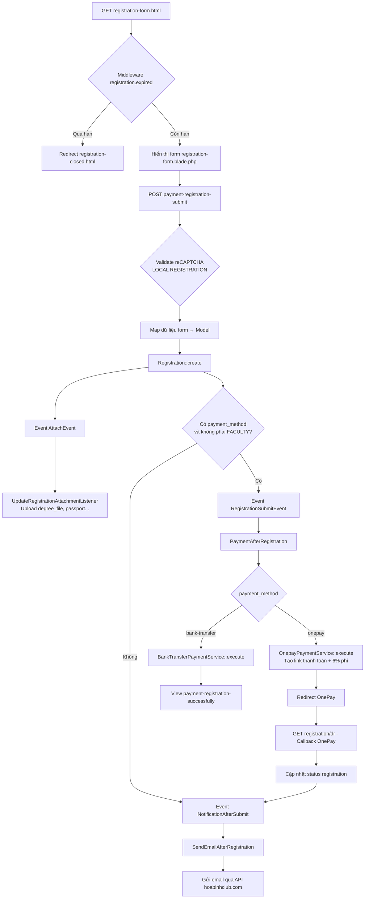

# Luồng đăng ký hội nghị VSIR2026

> Tài liệu tổng hợp luồng **đăng ký tham dự hội nghị** (Payment Registration) trong dự án `vsir2026.websitehoinghi.com`.  
> Module chính: `Modules/Registration` | Theme frontend: `Themes/apscvir2025v2`
>
> - **Phần A (mục 1–18):** Tổng quan luồng, routes, kiến trúc file  
> - **Phần B (mục 19–34):** Mô tả chi tiết code, schema, mapping, snippet — dùng để **port sang dự án khác**

---

## 1. Tổng quan

Hệ thống có **2 luồng đăng ký tách biệt**:

| Luồng | Mục đích | Route chính |
|-------|----------|-------------|
| **Đăng ký hội nghị** | Đại biểu đăng ký tham dự VSIR2026, chọn gói phí, thanh toán | `registration-form.html` → `payment-registration-submit` |
| **Đăng ký thành viên website** | Tạo tài khoản member để xem video/nội dung | `register.html` → `submit-register` |

Tài liệu này tập trung vào **luồng đăng ký hội nghị** (luồng chính).

---

## 2. Sơ đồ luồng chính



---

## 3. Routes (Frontend)

**File:** `Themes/apscvir2025v2/routes/web.php`

| Method | URL | Name | Handler |
|--------|-----|------|---------|
| GET | `registration.html` | `registration.info` | View `registration-info` (thông báo đóng đăng ký) |
| GET | `registration-form.html` | `registration.form` | `Apscvir2025v2Controller@registration` + middleware `registration.expired` |
| POST | `payment-registration-submit` | `payment.registration.submit` | `Apscvir2025v2Controller@paymentRegistrationSubmit` |
| GET | `registration/dr` | `payment.registration.dr` | `Apscvir2025v2Controller@handleRegistrationResponse` (callback OnePay) |
| GET | `registration/success` | `registration.successful` | View thành công thanh toán online |
| GET | `registration/cancel` | `registration.cancel` | View hủy thanh toán |
| GET | `registration/error` | `registration.error` | View lỗi |
| POST | `get-fee-total` | — | `Apscvir2025v2Controller@getFeeTotal` (API tính phí theo country) |
| GET | `register-here.html` | — | View chọn quốc gia (legacy) |
| GET | `register.html` | `member.register` | Đăng ký member website (luồng phụ) |
| POST | `submit-register` | `member.register.submit` | Đăng ký member website |

---

## 4. Database & Migrations

### 4.1. Bảng `registrations`

**Migration gốc:** `Modules/Registration/Database/Migrations/2023_10_24_075221_create_registration_table.php`

```sql
-- Cột ban đầu (migration gốc)
id, guest_code, title, fullname, jobtitle, department, country, address,
mobiphone, email, conference_fees, total_fees, attach, payment_method,
orderinfo, vpc_TransactionNo, status, txnResponseCode, checkin,
softDeletes, timestamps
```

**Migrations bổ sung:**

| File | Thay đổi |
|------|----------|
| `2025_12_26_143605_add_galadinner_column_to_registrations_table.php` | Thêm/sửa cột `galadinner` (boolean, default 0) |
| `2026_01_03_112406_add_degree_file_to_registrations_table.php` | Thêm cột `degree_file` (string 500, nullable) |

> **Lưu ý:** Model hiện tại dùng nhiều cột không có trong migration gốc (`affiliation`, `position`, `phone`, `day`, `month`, `year`, `passport`, `dietary`, `category`, `total`, `is_international`, `oral_attach`…). Các cột này có thể đã được thêm trực tiếp trên DB hoặc qua migration khác không nằm trong repo.

### 4.2. Cột Model `Registration` (fillable)

**File:** `Modules/Registration/Entities/Registration.php`

```
title, guest_code, fullname, expiryDate, position, affiliation, category,
galadinner, country, day, month, year, passport, phone, email, dietary,
conference_fees, total, attach, oral_attach, degree_file, payment_method,
is_international, orderinfo, status, txnResponseCode, vpc_TransactionNo
```

### 4.3. Logic tự động khi tạo record (`boot::creating`)

- `is_international` = 0 nếu `category == 'LOCAL REGISTRATION'`, ngược lại = 1
- `conference_fees` = JSON encode từ `feeId` hoặc `conference_checklist_item`
- `galadinner` = 0 hoặc 1 (boolean)
- `country` = request country hoặc mặc định `VN`
- `title` = `titleOther` ?? `title`
- `dietary` = `dietaryOther` ?? `dietary`
- `total` = `totalAmount` ?? `total_amount` ?? 0
- `guest_code` = `{prefix}-{sequence}` (prefix từ config `registration.email.code` = `VSIR2026`)

---

## 5. Model

**File:** `Modules/Registration/Entities/Registration.php`

| Thành phần | Mô tả |
|------------|-------|
| Table | `registrations` |
| Trait | `Attendance` — helper sinh mã guest |
| Casts | `galadinner`, `is_international` → boolean |
| Accessors | `registered_at`, `conference_type`, `country` (map tên quốc gia), `totalFormatted`, `totalTaxFormatted`, `subject` (email subject VI/EN), `registration_channel` |
| Methods | `unitByCategory()`, `paymentStatus()`, `urlAttachmentRegistration()`, `urlPassportRegistration()` |

**Repository:** `Modules/Registration/Repositories/Eloquent/RegistrationRepository.php`  
**Interface:** `Modules/Registration/Repositories/RegistrationInterface.php`

---

## 6. Controller

### 6.1. Frontend — `Apscvir2025v2Controller`

**File:** `Themes/apscvir2025v2/src/Http/Controllers/Apscvir2025v2Controller.php`

#### `registration()` — Hiển thị form
- Load JS: `jsvalidation.js`, `registration.js`
- JsValidator rules: title, fullname, affiliation, ngày sinh, phone, email, degree_file, dietary, conference_checklist_item, young_ir_proof_early, payment_method
- Render view `registration-form` + script validation

#### `paymentRegistrationSubmit()` — Xử lý submit
1. Validate reCAPTCHA v2 nếu `category === 'LOCAL REGISTRATION'`
2. Map dữ liệu form:
   - `total_amount` → `totalAmount`
   - `galadinner_fee` → `galadinner` (0/1)
   - `payment_method`: `onepay` → `PaymentMethodEnum::ONEPAY_PAYMENT`, `bank-transfer` → `BANK_TRANSFER`
   - `conference_checklist_item` → `feeId` (array)
3. Validate upload `young_ir_proof_early` nếu chọn gói `young_ir` / `young_doctor`
4. `Registration::create($data)`
5. `event(new AttachEvent($request, $registration))` — upload file
6. Nếu có `payment_method` và `category != 'FACULTY / INVITED GUEST'`:
   - `event(new RegistrationSubmitEvent(...))` → xử lý thanh toán
   - OnePay → redirect URL thanh toán
   - Bank transfer → view `payment-registration-successfully`
7. Ngược lại (Faculty/Invited):
   - `event(new NotificationAfterSubmit($registration))`
   - View `plenary-registration-successfully`

#### `handleRegistrationResponse()` — Callback OnePay
- Parse response qua `OnepayPaymentService`
- Cập nhật `orderinfo`, `txnResponseCode`, `vpc_TransactionNo`, `status`
- `event(new NotificationAfterSubmit($registration))`
- Redirect success/cancel/error

#### `getFeeTotal()` — API tính phí (legacy, dùng bảng Fees)

### 6.2. Admin — `RegistrationController`

**File:** `Modules/Registration/Http/Controllers/RegistrationController.php`

| Action | Chức năng |
|--------|-----------|
| `index` | Danh sách đăng ký (DataTable) |
| `create` / `store` | Thêm đăng ký thủ công từ CMS |
| `edit` / `update` | Sửa đăng ký |
| `destroy` / `deletes` | Xóa |
| `restore` | Khôi phục (soft delete) |
| `export` | Xuất Excel |
| `subscribe` | Danh sách subscribe (phụ) |

---

## 7. Request & Validation

### 7.1. Frontend validation

**JsValidator** (client-side) trong `Apscvir2025v2Controller@registration`

**Server-side** trong `paymentRegistrationSubmit`:
- reCAPTCHA: `Modules/Registration/Rules/ValidRecaptcha.php`
- Upload young IR: kiểm tra thủ công trong controller

### 7.2. Admin FormRequest

**File:** `Modules/Registration/Http/Requests/RegistrationRequest.php`

```php
title, titleOther (required_if title=5), fullname, affiliation, phone,
category_id, dietary, dietaryOther, payment_method
```

**File legacy (không dùng cho luồng chính):** `app/Http/Requests/RegistrationRequest.php` — validate `attendances` table

### 7.3. Middleware

**File:** `Modules/Registration/Http/Middleware/RegistrationCloseBeforeExpire.php`

- Alias: `registration.expired`
- So sánh `Carbon::now()` với `config('registration.registration_deadline')`
- Quá hạn → redirect `/registration-closed.html`

---

## 8. Events & Listeners

**File:** `Modules/Registration/Providers/EventServiceProvider.php`

| Event | Listener | Mô tả |
|-------|----------|-------|
| `RegistrationSubmitEvent` | `PaymentAfterRegistration` | Xử lý thanh toán sau submit |
| `AttachEvent` | `UpdateRegistrationAttachmentListener` | Upload file đính kèm |
| `NotificationAfterSubmit` | `SendEmailAfterRegistration` | Gửi email xác nhận |
| `PaymentEvent` | `PaymentAfterRegistration` | Hook payment module |
| `AttachFullpaperEvent` | `UploadFullpaperListener` | Fullpaper (luồng khác) |

### 8.1. `PaymentAfterRegistration`

**File:** `Modules/Registration/Listeners/PaymentAfterRegistration.php`

```
ONEPAY_PAYMENT  → OnepayPaymentService::execute()
BANK_TRANSFER   → BankTransferPaymentService::execute()
default         → filter PAYMENT_FILTER_AFTER_POST_CHECKOUT
```

### 8.2. `UpdateRegistrationAttachmentListener`

**File:** `Modules/Registration/Listeners/UpdateRegistrationAttachmentListener.php`

Upload các field:
- `attachment` → `attach`
- `card_student` → `card_student`
- `abstract_file` → `abstract_file`
- `oral_attach` → `oral_attach`
- `passport` → `passport`
- `degree_file` → `degree_file` (path: `{APP_NAME}/files/registration/degree/{id}/`)

> **Gap:** Field `young_ir_proof_early` được validate ở controller nhưng **chưa có handler upload** trong listener.

### 8.3. Hook sau payment processed

**File:** `Modules/Registration/Providers/RegistrationServiceProvider.php`

Khi `PAYMENT_ACTION_PAYMENT_PROCESSED` → fire `NotificationAfterSubmit` (OnePay, Bank transfer, default).

---

## 9. Services

| Service | File | Vai trò |
|---------|------|---------|
| `OnepayPaymentService` | `Modules/Payment/Services/OnepayPaymentService.php` | Tạo link OnePay (+6% phí), xử lý callback |
| `BankTransferPaymentService` | `Modules/Payment/Services/BankTransferPaymentService.php` | Set view data bank transfer |
| `AttendanceService` | `Modules/Registration/Services/AttendanceService.php` | Wrapper `Registration::create()` (ít dùng) |
| `RDExtraction` | `Modules/Registration/Services/RDExtraction.php` | Trích xuất text DOCX (abstract/fullpaper) |

### OnePay flow chi tiết

1. `execute()` → `do_action(PAYMENT_ACTION_PAYMENT_PROCESSED)` → `handleBeforePaymentPageRedirect()`
2. Chọn merchant theo locale session: `en` → `international`, còn lại → `international_vnd`
3. `buildPaymentLink(guest_code, guest_code_timestamp, amount+6%, returnURL)`
4. Set attribute `ONEPAY_PAYMENT_REDIRECT` trên model
5. Callback `registration/dr` → cập nhật status → gửi email

---

## 10. Views (Frontend)

| View | File | Mô tả |
|------|------|-------|
| Trang thông tin | `Themes/apscvir2025v2/views/registration-info.blade.php` | Thông báo đăng ký đã đóng |
| Form đăng ký | `Themes/apscvir2025v2/views/registration-form.blade.php` | Form chính (chỉ hiển thị đầy đủ khi locale = vi) |
| Chọn quốc gia | `Themes/apscvir2025v2/views/registration-page.blade.php` | Legacy |
| Thành công bank transfer | `Themes/apscvir2025v2/views/partials/payment-registration-successfully.blade.php` | Hiển thị mã đăng ký + thông tin chuyển khoản |
| Thành công faculty | `Themes/apscvir2025v2/views/partials/plenary-registration-successfully.blade.php` | Faculty/Invited |
| Thành công OnePay | `Themes/apscvir2025v2/views/partials/successful.blade.php` | Sau callback thành công |
| Hủy OnePay | `Themes/apscvir2025v2/views/partials/cancel.blade.php` | |
| Email wrapper | `Themes/apscvir2025v2/views/email/registration-template.blade.php` | Template bọc nội dung email (local test) |
| JS validation view | `Modules/Registration/Resources/views/validation` | JsValidator template |

### Form fields chính (`registration-form.blade.php`)

**Thông tin chung:** title, titleOther, fullname, affiliation, position, day/month/year, phone, email, degree_file

**Ăn kiêng:** dietary, dietaryOther

**Phí tham dự (LOCAL):** radio `conference_checklist_item` với các value:
- `vsir_member` — VND 2.500.000
- `non_vsir_member` — VND 3.000.000
- `medical_staff` — VND 1.000.000 / 2.000.000
- `young_ir` / `young_doctor` — cần upload `young_ir_proof_early`
- (và các gói khác theo bảng phí)

**Thanh toán:** `payment_method` = `onepay` | `bank-transfer`

**Hidden:** `category=LOCAL REGISTRATION`, `country=VN`, `total_amount`

**reCAPTCHA:** hiển thị khi có `GOOGLE_RECAPTCHA_KEY` (chỉ form tiếng Việt)

### Helper phí

**File:** `Themes/apscvir2025v2/functions/functions.php`

- `conferenceFees()` — bảng phí early bird / regular
- `conferenceFeesById()` — map id → tên gói
- `checkExpiredFee()` — kiểm tra trước/sau 20/03/2026
- `allCountries()` — danh sách quốc gia
- `sendEmail()` — gửi mail qua Laravel Mail (dùng cho local/test)

---

## 11. Quản trị (Admin CMS)

### 11.1. Menu

**File:** `Modules/Registration/Providers/RegistrationServiceProvider.php`

- **Registration** → `route('registration.index')` — icon `ft-users`
- **Faculty** → `route('registration.faculty.index')`
- **Fullpaper** → `route('registration.fullpaper.index')`

### 11.2. Routes admin

**File:** `Modules/Registration/Routes/backend.php`  
Prefix: `{BACKEND}/registration`

```
GET  /registration              → index (danh sách)
GET  /registration/create       → create
POST /registration              → store
GET  /registration/{id}/edit    → edit
PUT  /registration/{id}         → update
GET  /registration/export       → export Excel
POST /registration/delete/{id}  → destroy
POST /registration/deletes      → bulk delete
GET  /registration/restore/{id} → restore
```

### 11.3. DataTable

**File:** `Modules/Registration/Tables/RegistrationTable.php`

Cột hiển thị: id, fullname, guest_code, email, created_at, payment_method, vpc_TransactionNo, status

Nút **Xuất Excel** → `RegistrationExport`

### 11.4. Form admin

**File:** `Modules/Registration/Forms/RegistrationForm.php`  
Form đơn giản: name, status (FormBuilder CMS — không mirror đầy đủ form frontend)

### 11.5. Export Excel

**File:** `Modules/Registration/Exports/RegistrationExport.php`

Xuất 22 cột: Date, Registration ID, Title, Full name, Affiliation, Position, Country, DOB, Passport, Phone, Email, Galadinner, Dietary, Category, Fee, Bằng cấp (hyperlink), Attach, Trans.ID, Payment method, Total, Payment status

### 11.6. Permissions

**File:** `Modules/Registration/Config/permissions.php`

`registration.index`, `.create`, `.edit`, `.delete`, `.export`, `.restore`, `.deletes`, abstract/fullpaper/faculty permissions

---

## 12. Mail

### 12.1. Luồng gửi email

```
NotificationAfterSubmit
  → SendEmailAfterRegistration::handle()
    → Chọn template theo registration_channel + quốc gia
    → parseContent(template, params)
    → SendRegistrationEmail::sending() → API POST
```

### 12.2. Listener chính

**File:** `Modules/Registration/Listeners/SendEmailAfterRegistration.php`

**Params email:** title, fullname, affiliation, country, guest_code, email, category, conference_type, total, subject, payment_link (OnePay)

**Chọn template:**

| Điều kiện | Template key |
|-----------|--------------|
| OnePay + Việt Nam | `onepay-payment-non-international` |
| OnePay + Quốc tế | `onepay-payment` (registration_channel) |
| Bank transfer + Việt Nam | `bank-transfer-non-international` |
| Bank transfer + Quốc tế | `bank-transfer` |
| Faculty/Invited | `plenary-invited-speakers` |

Fallback: template theo `registration_channel`

**Môi trường local:** gửi test tới `minhphamquang028@gmail.com` qua helper `sendEmail()`

### 12.3. Trait gửi email

**File:** `Modules/Registration/Traits/SendRegistrationEmail.php`

- POST tới `config('registration.email.endpoint')` = `https://hoabinhclub.com/api/email/service`
- Payload: sending_server, email, from_email, from_name, subject, reply_to, addCC, template
- CC mặc định: `info@vsir.vn`

### 12.4. Cấu hình email

**File:** `Modules/Registration/Config/config.php`

```php
'email' => [
    'endpoint' => 'https://hoabinhclub.com/api/email/service',
    'code' => 'VSIR2026',           // prefix guest_code
    'cc' => [['info@vsir.vn', 'VSIR2026']],
    'sending_server' => 13,
    'from_email' => 'info@vsir.vn',
    'from_name' => 'info@vsir.vn',
    'subject' => 'VSIR 2026 Registration Confirmation',
    'reply_to' => 'info@vsir.vn',
]
'registration_deadline' => '2026-12-31 23:59:00'
```

### 12.5. Quản lý template email (Admin Settings)

**File:** `Modules/Registration/Resources/views/email/setting.blade.php`

Hook: `BASE_FILTER_EMAIL_AFTER_SETTING_CONTENT` trong `RegistrationServiceProvider@addSettings`

Templates TinyMCE trong Settings:
- `plenary-invited-speakers`
- `fullpaper-submission`
- `onepay-payment`
- `bank-transfer`
- `onepay-payment-non-international`
- `bank-transfer-non-international`
- `send-password` (member register)

Biến template dùng cú pháp `{field}` qua trait `ParseContent`.

### 12.6. Subject email tự động

**Model accessor `getSubjectAttribute`:**
- Việt Nam: `Xác nhận thanh toán VSIR2026 – {title} {fullname}`
- Quốc tế: `VSIR2026 Payment Confirmation – {title} {fullname}`

---

## 13. Config & Constants

| Key | Giá trị | File |
|-----|--------|------|
| `registration.registration_deadline` | `2026-12-31 23:59:00` | `Modules/Registration/Config/config.php` |
| `registration.email.code` | `VSIR2026` |同上 |
| `GOOGLE_RECAPTCHA_KEY` / `GOOGLE_RECAPTCHA_SECRET` | env | `.env` |
| Payment enum | `ONEPAY_PAYMENT`, `BANK_TRANSFER` | `Modules/Payment/Enums/PaymentMethodEnum.php` |

**Constants:** `Modules/Registration/Helpers/constants.php` — `REGISTRATION_NAME`, `BANK_TRANSFER`, `ONLINE_PAYMENT`

---

## 14. Enum trạng thái thanh toán

**File:** `Modules/Registration/Enums/PaymentStatusEnums.php`

`successful`, `cancelled`, `failed`, `pending` — có method `toHtml()` render badge trong admin table.

---

## 15. Luồng phụ liên quan

### 15.1. Đăng ký Member website

**Controller:** `Themes/apscvir2025v2/src/Http/Controllers/MemberController.php`

- Tạo record trong bảng `members`
- Password cố định: `hbg-apscvir2025`
- Gửi email qua `NotificationAfterSubmit` với channel `send-password`

### 15.2. Abstract / Fullpaper / Faculty / Invited

Cùng module Registration nhưng luồng riêng:
- Abstract: `SubmissionController`, bảng `abstract_submissions`
- Fullpaper: `FullpaperSubmissionController`
- Faculty: `FacultyController`, bảng `faculty`
- Invited: bảng `invited`

---

## 16. Test

**File:** `tests/Feature/PaymentRegistrationSubmitTest.php`

Feature test POST `payment.registration.submit` với dữ liệu mẫu (degree_file fake, category LOCAL REGISTRATION).

---

## 17. Sơ đồ file tham chiếu

```
Modules/Registration/
├── Config/
│   ├── config.php              # deadline, email API
│   └── permissions.php
├── Database/Migrations/
│   ├── 2023_10_24_075221_create_registration_table.php
│   ├── 2025_12_26_143605_add_galadinner_column_to_registrations_table.php
│   └── 2026_01_03_112406_add_degree_file_to_registrations_table.php
├── Entities/
│   └── Registration.php        # Model chính
├── Events/
│   ├── AttachEvent.php
│   ├── RegistrationSubmitEvent.php
│   └── NotificationAfterSubmit.php
├── Exports/
│   └── RegistrationExport.php
├── Forms/
│   └── RegistrationForm.php    # Form admin CMS
├── Http/
│   ├── Controllers/RegistrationController.php
│   ├── Middleware/RegistrationCloseBeforeExpire.php
│   └── Requests/RegistrationRequest.php
├── Listeners/
│   ├── PaymentAfterRegistration.php
│   ├── SendEmailAfterRegistration.php
│   └── UpdateRegistrationAttachmentListener.php
├── Providers/
│   ├── RegistrationServiceProvider.php
│   ├── EventServiceProvider.php
│   └── RouteServiceProvider.php
├── Repositories/
│   └── Eloquent/RegistrationRepository.php
├── Routes/
│   └── backend.php
├── Services/
│   └── AttendanceService.php
├── Tables/
│   └── RegistrationTable.php
├── Traits/
│   ├── Attendance.php
│   └── SendRegistrationEmail.php
└── Resources/views/email/
    └── setting.blade.php       # Admin email templates

Themes/apscvir2025v2/
├── routes/web.php              # Routes frontend
├── src/Http/Controllers/
│   └── Apscvir2025v2Controller.php  # Controller chính frontend
├── views/
│   ├── registration-form.blade.php
│   ├── registration-info.blade.php
│   └── partials/payment-registration-successfully.blade.php
├── functions/functions.php     # conferenceFees(), sendEmail()
└── assets/js/registration.js

Modules/Payment/Services/
├── OnepayPaymentService.php
└── BankTransferPaymentService.php
```

---

## 18. Ghi chú kỹ thuật & điểm cần lưu ý

1. **Locale tiếng Anh:** Form `registration-form` chỉ hiển thị thông báo "Registration only for Vietnamese participants", không submit được.
2. **Trang `registration-info`:** Hiện đang hiển thị "Đăng ký đã đóng" — có thể khác với middleware deadline (`2026-12-31`).
3. **Schema DB vs Model:** Migration gốc thiếu nhiều cột mà Model đang dùng — cần đối chiếu DB thực tế khi deploy mới.
4. **`young_ir_proof_early`:** Validate ở controller nhưng chưa lưu file trong `UpdateRegistrationAttachmentListener`.
5. **Phí form vs helper:** Form hardcode giá (vd. 2.500.000) trong blade; helper `conferenceFees()` có bảng giá khác (early bird) — cần đồng bộ nếu thay đổi phí.
6. **OnePay phí 6%:** Tính trong `OnepayPaymentService::getAmount()` — email hiển thị `totalTaxFormatted`.
7. **Email local:** Tự redirect về email test, production gửi qua API Hoa Binh Club.

---

# PHẦN B — MÔ TẢ CHI TIẾT CODE (PORT SANG DỰ ÁN KHÁC)

---

## 19. Kiến trúc & phụ thuộc module

Dự án dùng **Laravel + nwidart/laravel-modules** (modular monolith). Luồng đăng ký **không đứng độc lập** — cần các module/package sau:

| Module / Package | Vai trò trong luồng đăng ký |
|------------------|----------------------------|
| `Modules/Registration` | Model, Events, Listeners, Admin, Export, Middleware |
| `Modules/Payment` | OnePay library, Payment services, enums |
| `Modules/Base` | `ParseContent` trait, FormBuilder, TableAbstract, Repository base |
| `Modules/Theme` | `PublicController`, `Theme::current()`, Assets |
| `Modules/Setting` | `setting('onepay-payment')` — lưu template email trong DB |
| `Modules/Acl` | Phân quyền admin (`registration.index`…) |
| Theme `apscvir2025v2` | Routes frontend, Controller submit, Views form |
| `proengsoft/laravel-jsvalidation` | JsValidator client-side |
| `maatwebsite/excel` | Export Excel admin |
| `guzzlehttp/guzzle` | ValidRecaptcha verify |

**Hook system (WordPress-style):** Dự án dùng `add_action()` / `apply_filters()` từ `Modules/Base`. Payment và email gắn qua hook:

```php
// Modules/Payment/Helpers/constants.php
define('PAYMENT_ACTION_PAYMENT_PROCESSED', 'payment-action-payment-processed');
define('PAYMENT_FILTER_AFTER_POST_CHECKOUT', 'payment-after-post-checkout');
define('BASE_FILTER_EMAIL_AFTER_SETTING_CONTENT', '...'); // hook template email admin
```

Nếu port sang Laravel thuần (không modular): thay hook bằng **Event/Listener** hoặc **Service class** gọi trực tiếp.

---

## 20. Checklist port sang dự án mới

### Bước 1 — Database
- [ ] Tạo bảng `registrations` theo schema đầy đủ (mục 21)
- [ ] Chạy migration hoặc import SQL
- [ ] Bảng `settings` (nếu dùng `setting()` helper) — lưu key template email

### Bước 2 — Copy / viết lại code lõi
- [ ] `Registration` model + `boot::creating`
- [ ] 3 Events: `AttachEvent`, `RegistrationSubmitEvent`, `NotificationAfterSubmit`
- [ ] 3 Listeners: upload file, payment, send email
- [ ] `OnepayPaymentService`, `BankTransferPaymentService`, class `Onepay`
- [ ] Trait `SendRegistrationEmail`, `ParseContent`
- [ ] `ValidRecaptcha` rule
- [ ] Middleware `RegistrationCloseBeforeExpire`

### Bước 3 — Frontend
- [ ] Routes: form GET, submit POST, callback OnePay GET
- [ ] Controller `paymentRegistrationSubmit` + `handleRegistrationResponse`
- [ ] View `registration-form.blade.php`
- [ ] Views success/cancel/error
- [ ] Đăng ký middleware alias `registration.expired`

### Bước 4 — Payment
- [ ] Config OnePay merchant (`payment.info.international_vnd` cho VN)
- [ ] Route callback `registration/dr` phải public, không CSRF (GET từ OnePay)
- [ ] Test sandbox OnePay

### Bước 5 — Email
- [ ] Config API endpoint + sending_server
- [ ] Tạo template HTML trong settings (6 key)
- [ ] Test local vs production branch trong `SendEmailAfterRegistration`

### Bước 6 — Admin (tùy chọn)
- [ ] `RegistrationController` + `RegistrationTable` + Export
- [ ] Menu CMS + permissions

### Bước 7 — Env
```env
APP_NAME=vsir2026
APP_URL=https://your-domain.com
GOOGLE_RECAPTCHA_KEY=...
GOOGLE_RECAPTCHA_SECRET=...
FILESYSTEM_DISK=local   # hoặc s3/spaces cho production
MAIL_FROM_ADDRESS=info@vsir.vn
```

---

## 21. Schema DB đầy đủ (khuyến nghị khi port)

Migration gốc trong repo **không đủ**. Dưới đây là schema **thực tế model đang dùng** — nên tạo 1 migration mới gộp:

```php
Schema::create('registrations', function (Blueprint $table) {
    $table->increments('id');
    $table->string('guest_code', 150)->nullable()->index();
    $table->string('title', 300)->nullable();
    $table->string('fullname', 250);
    $table->string('position', 250)->nullable();
    $table->string('affiliation', 300)->nullable();
    $table->string('category', 100)->nullable();          // LOCAL REGISTRATION, INTERNATIONAL...
    $table->boolean('galadinner')->default(0);
    $table->string('country', 120)->nullable()->default('VN');
    $table->unsignedTinyInteger('day')->nullable();
    $table->unsignedTinyInteger('month')->nullable();
    $table->unsignedSmallInteger('year')->nullable();
    $table->string('passport', 500)->nullable();          // path file
    $table->string('phone', 50)->nullable();
    $table->string('email', 150);
    $table->string('dietary', 300)->nullable();
    $table->string('conference_fees', 500)->nullable(); // JSON: ["vsir_member"]
    $table->decimal('total', 15, 2)->default(0);
    $table->string('attach', 500)->nullable();
    $table->string('oral_attach', 500)->nullable();
    $table->string('degree_file', 500)->nullable();
    $table->string('payment_method', 50)->nullable();     // onepay-payment | bank-transfer
    $table->boolean('is_international')->default(0);
    $table->string('orderinfo', 250)->nullable();
    $table->string('vpc_TransactionNo', 300)->nullable();
    $table->string('status', 50)->nullable();             // successful|pending|failed|cancelled
    $table->string('txnResponseCode', 300)->nullable();
    $table->unsignedTinyInteger('checkin')->default(0);
    $table->softDeletes();
    $table->timestamps();
});
```

**Lưu `conference_fees`:** Không phải ID số từ bảng `fees` — form VSIR2026 lưu **string slug** (`vsir_member`, `young_ir`…) dạng JSON array.

---

## 22. Bảng mapping Form → Request → Model → DB

| Field HTML (name) | Xử lý trước create | Cột DB | Ghi chú |
|-------------------|-------------------|--------|---------|
| `title` | — | `title` | Nếu chọn "other" → boot ghi `titleOther` |
| `titleOther` | boot → `title` | `title` | Không lưu riêng |
| `fullname` | — | `fullname` | |
| `affiliation` | — | `affiliation` | |
| `position` | — | `position` | |
| `day`, `month`, `year` | — | `day`, `month`, `year` | |
| `phone` | — | `phone` | Migration gốc: `mobiphone` |
| `email` | — | `email` | |
| `degree_file` | AttachEvent listener | `degree_file` | Path sau upload |
| `dietary` / `dietaryOther` | boot → `dietary` | `dietary` | |
| `conference_checklist_item` | controller → `feeId[]` → boot JSON | `conference_fees` | VD: `["vsir_member"]` |
| `galadinner_fee` | controller → `galadinner` 0/1 | `galadinner` | Chỉ flag, không lưu giá |
| `total_amount` | controller → `totalAmount` → boot → `total` | `total` | Số nguyên VND |
| `payment_method` | map `onepay`→`onepay-payment` | `payment_method` | |
| `category` | boot → `is_international` | `category` | LOCAL=0, khác=1 |
| `country` | boot default VN | `country` | Code ISO, accessor đổi tên |
| `young_ir_proof_early` | validate only | — | **Chưa lưu DB** |
| `g-recaptcha-response` | validate, không lưu | — | |

---

## 23. Chi tiết code — Model `Registration`

**File:** `Modules/Registration/Entities/Registration.php`

### 23.1. `boot::creating` — logic quan trọng nhất khi port

```php
protected static function boot()
{
    parent::boot();

    static::creating(function ($registration) {
        // Phân loại trong nước / quốc tế
        $registration->is_international = (request()->category == 'LOCAL REGISTRATION') ? 0 : 1;

        // Gói phí → JSON string
        $feeData = request()->feeId ?? request()->conference_checklist_item;
        if ($feeData) {
            $registration->conference_fees = json_encode(
                is_array($feeData) ? $feeData : [$feeData]
            );
        }

        // Gala dinner: chỉ 0 hoặc 1
        $galadinnerValue = (int) ($registration->galadinner ?? 0);
        $registration->galadinner = ($galadinnerValue == 1) ? 1 : 0;

        $registration->country = request()->country ?? 'VN';
        $registration->title = request()->titleOther ?? request()->title;
        $registration->dietary = request()->dietaryOther ?? request()->dietary;
        $registration->total = request()->totalAmount ?? request()->total_amount ?? 0;
        $registration->guest_code = $registration->generateGuestCode();
    });
}
```

**Lưu ý port:** `boot::creating` đọc trực tiếp `request()` global — khi tạo từ admin/queue cần set request hoặc chuyển logic sang Service.

### 23.2. Sinh mã đăng ký

```php
protected function generateGuestCode()
{
    $prefix = config('registration.email.code'); // 'VSIR2026'
    $sequence = sprintf("%03s", $this->count() + 1);
    return "{$prefix}-{$sequence}";  // VD: VSIR2026-001
}
```

**Rủi ro:** `count()` đếm toàn bảng, không thread-safe — có thể trùng mã khi concurrent. Port nên dùng `max(id)+1` hoặc UUID.

### 23.3. Accessors dùng cho email

```php
// Tiền hiển thị: VND2,500,000.00 hoặc US$100.00
public function getTotalFormattedAttribute()
{
    $formatted = number_format($this->total, 2);
    return $this->unitByCategory() . $formatted;
}

// OnePay email dùng total + 6%
public function getTotalTaxFormattedAttribute()
{
    $formatted = number_format($this->total + ($this->total * 0.06), 2);
    return $this->unitByCategory() . $formatted;
}

// Kênh email / template key
public function getRegistrationChannelAttribute()
{
    if (!$this->payment_method) {
        return 'plenary-invited-speakers';
    }
    return $this->payment_method; // 'onepay-payment' | 'bank-transfer'
}
```

### 23.4. `getCountryAttribute` — side effect

Accessor **ghi đè** `country` từ code (`VN`) sang tên (`Việt Nam`). Khi check `isVietnam` trong email listener, phải đọc `$model->attributes['country']` hoặc `getOriginal('country')` — **không** dùng `$model->country`.

---

## 24. Chi tiết code — Controller frontend

**File:** `Themes/apscvir2025v2/src/Http/Controllers/Apscvir2025v2Controller.php`

### 24.1. `registration()` — load form

```php
public function registration()
{
    Assets::addJs([
        asset('vendor/jsvalidation/js/jsvalidation.js'),
        themes('js/registration.js?v=' . time())
    ]);

    $validator = JsValidator::make(
        [ /* rules */ ],
        [ /* messages */ ],
        [],
        '#payment-registration',  // form selector
    )->view('registration::validation')->render();

    return view(Theme::current() . '::registration-form') . $validator;
}
```

**Port:** Có thể bỏ JsValidator, dùng Laravel `FormRequest` thuần. `registration.js` hiện phục vụ form **đa category** (international/local/faculty) — form VSIR2026 mới hardcode phí trong blade + inline JS tính `total_amount`.

### 24.2. `paymentRegistrationSubmit()` — toàn bộ luồng submit

```php
public function paymentRegistrationSubmit(Request $request)
{
    // 1. reCAPTCHA (chỉ LOCAL)
    if ($request->input('category') === 'LOCAL REGISTRATION' && env('GOOGLE_RECAPTCHA_SECRET')) {
        $request->validate([
            'g-recaptcha-response' => ['required', new ValidRecaptcha()],
        ]);
    }

    // 2. Map form → model input
    $data = $request->all();
    unset($data['galadinner']);
    $data['totalAmount'] = $request->total_amount;
    $data['galadinner'] = $request->has('galadinner_fee') ? 1 : 0;
    $data['payment_method'] = $request->payment_method === 'onepay'
        ? PaymentMethodEnum::ONEPAY_PAYMENT
        : PaymentMethodEnum::BANK_TRANSFER;
    $data['feeId'] = is_array($request->conference_checklist_item)
        ? $request->conference_checklist_item
        : [$request->conference_checklist_item];

    // 3. Validate file young IR
    // 4. Create
    $registration = Registration::create($data);

    // 5. Upload files
    event(new AttachEvent($request, $registration));

    // 6. Payment branch
    if ($request->has('payment_method') && $request->category != 'FACULTY / INVITED GUEST') {
        event(new RegistrationSubmitEvent($request, $registration));

        if ($redirect = $registration->getAttribute(PaymentMethodEnum::ONEPAY_PAYMENT_REDIRECT)) {
            return redirect()->away($redirect);
        }
        if ($viewData = $registration->getAttribute(PaymentMethodEnum::BANK_TRANSFER_FEEDBACK)) {
            return view('...payment-registration-successfully', $viewData);
        }
        return view('...payment-registration-successfully', ['registration' => $registration]);
    }

    // 7. Faculty — không thanh toán
    event(new NotificationAfterSubmit($registration));
    return view('...plenary-registration-successfully');
}
```

**Thứ tự bắt buộc:** `create` → `AttachEvent` → `RegistrationSubmitEvent`. Email bank transfer gửi **ngay** trong `RegistrationSubmitEvent` qua hook `PAYMENT_ACTION_PAYMENT_PROCESSED`, **trước** khi render view thành công.

### 24.3. `handleRegistrationResponse()` — callback OnePay

```php
protected function handleRegistrationResponse(OnepayPaymentService $onepayPaymentService)
{
    $payloadResponse = $onepayPaymentService->handleResponse($_REQUEST);

    $registration = Registration::where('guest_code', $_REQUEST['vpc_OrderInfo'])->first();

    if ($registration) {
        $registration->update([
            'orderinfo' => $_REQUEST['vpc_OrderInfo'],
            'txnResponseCode' => $_REQUEST['vpc_TxnResponseCode'],
            'vpc_TransactionNo' => $_REQUEST['vpc_TransactionNo'] ?? null,
            'status' => $payloadResponse['status'],
        ]);
        $registration->registration_channel = PaymentMethodEnum::ONEPAY_PAYMENT;
    }

    event(new NotificationAfterSubmit($registration));
    return redirect()->route($payloadResponse[PaymentMethodEnum::ONEPAY_PAYMENT_FEEDBACK]);
}
```

**Tham số OnePay quan trọng:**
- `vpc_OrderInfo` = `guest_code` (VD: `VSIR2026-001`)
- `vpc_MerchTxnRef` = `guest_code_timestamp` (unique mỗi lần thanh toán)
- `vpc_TxnResponseCode` = `0` thành công, `99` hủy

**Route phải là GET** (OnePay redirect browser). Không verify CSRF.

---

## 25. Chi tiết code — Events & Listeners

### 25.1. Event classes (cấu trúc giống nhau)

```php
class RegistrationSubmitEvent
{
    use SerializesModels;
    public $request;  // Illuminate\Http\Request
    public $data;     // Registration model

    public function __construct($request, $data)
    {
        $this->request = $request;
        $this->data = $data;
    }
}
```

`AttachEvent` và `NotificationAfterSubmit` tương tự (`NotificationAfterSubmit` chỉ có `$data`).

### 25.2. Đăng ký listener

```php
// Modules/Registration/Providers/EventServiceProvider.php
protected $listen = [
    RegistrationSubmitEvent::class => [PaymentAfterRegistration::class],
    AttachEvent::class => [UpdateRegistrationAttachmentListener::class],
    NotificationAfterSubmit::class => [SendEmailAfterRegistration::class],
];
```

### 25.3. `PaymentAfterRegistration`

```php
public function handle($data)
{
    switch ($data->data->payment_method) {
        case PaymentMethodEnum::ONEPAY_PAYMENT:
            $data->charge_id = app(OnepayPaymentService::class)->execute($data->data);
            break;
        case PaymentMethodEnum::BANK_TRANSFER:
            $data->charge_id = app(BankTransferPaymentService::class)->execute($data->data);
            break;
    }
    return $data;
}
```

`$data->data` là **Registration model** (tên property `data` trong event).

### 25.4. `OnepayPaymentService::execute`

```php
public function execute($data)
{
    $chargeId = Str::upper(Str::random(10));
    do_action(PAYMENT_ACTION_PAYMENT_PROCESSED, $data);  // → gửi email pending
    $this->handleBeforePaymentPageRedirect($data);        // → set redirect URL
    return $chargeId;
}

protected function handleBeforePaymentPageRedirect($registration)
{
    $onepay = new Onepay(
        session('frontend-locale', app()->getLocale()) == 'en'
            ? 'international'
            : 'international_vnd'
    );
    $url = $onepay->buildPaymentLink(
        $registration->guest_code,                    // vpc_OrderInfo
        $registration->guest_code . '_' . time(),     // vpc_MerchTxnRef
        $registration->total * 1.06,                  // amount + 6%
        route('payment.registration.dr')              // vpc_ReturnURL
    );
    $registration->setAttribute('onepay-payment-redirect', $url);
}
```

**Port:** `setAttribute` trên model **không persist DB** — chỉ dùng trong cùng request để controller đọc redirect URL.

### 25.5. `BankTransferPaymentService`

```php
public function execute($data)
{
    do_action(PAYMENT_ACTION_PAYMENT_PROCESSED, $data);  // gửi email
    $data->setAttribute('bank-transfer-feedback', $data); // truyền model sang view
    return Str::upper(Str::random(10));
}
```

### 25.6. Hook gửi email sau payment

```php
// RegistrationServiceProvider::boot()
add_action(PAYMENT_ACTION_PAYMENT_PROCESSED, function ($data) {
    event(new NotificationAfterSubmit($data));
}, 123);
```

→ Bank transfer và OnePay **đều gửi email ngay khi submit** (trạng thái pending). OnePay gửi thêm email sau callback nếu `handleRegistrationResponse` fire lại event.

### 25.7. `UpdateRegistrationAttachmentListener` — upload `degree_file`

```php
protected function updateDegreeFileAttachment($request, $registration)
{
    $file = $request->file('degree_file');
    $filename = $file->getClientOriginalName();
    $storagePath = (env('APP_NAME') ?: 'vsir2026') . '/files/registration/degree/' . $registration->id;

    $path = $file->storeAs($storagePath, $filename, config('filesystems.default'));

    $registration->degree_file = $path;
    $registration->save();
}
```

**Port:** Đổi `filesystems.default` + cấu hình S3/Spaces nếu cần. URL public: `Storage::url($path)`.

**Bổ sung khi port** — handler cho `young_ir_proof_early`:

```php
if ($request->hasFile('young_ir_proof_early')) {
    $path = $request->file('young_ir_proof_early')->storeAs(
        env('APP_NAME') . '/files/registration/young_ir/' . $registration->id,
        $request->file('young_ir_proof_early')->getClientOriginalName(),
        config('filesystems.default')
    );
    $registration->attach = $path; // hoặc thêm cột young_ir_proof
    $registration->save();
}
```

---

## 26. Chi tiết code — Email

### 26.1. `SendEmailAfterRegistration::handle`

```php
public function handle($data): void
{
    $params = $data->data->toArray();
    $params['conference_type'] = $data->data->conference_type;
    $params['subject'] = $data->data->subject;
    $params['total'] = $data->data->totalFormatted;

    $countryCode = $data->data->attributes['country'] ?? 'VN';
    $isVietnam = !$data->data->is_international || $countryCode === 'VN';

    if ($data->data->registration_channel == PaymentMethodEnum::ONEPAY_PAYMENT) {
        $params['total'] = $data->data->totalTaxFormatted;
        $params['payment_link'] = $data->data->getAttribute('onepay-payment-redirect') ?? '';
        $templateKey = $isVietnam ? 'onepay-payment-non-international' : 'onepay-payment';
    } else {
        $templateKey = $isVietnam ? 'bank-transfer-non-international' : 'bank-transfer';
    }

    $template = $this->parseContent(setting($templateKey), $params);

    if (app()->isLocal()) {
        sendEmail('test@example.com', $params['subject'], $template);
    } else {
        $this->sending($params, $template);
    }
}
```

### 26.2. Parse template — cú pháp biến

**File:** `Modules/Base/Traits/ParseContent.php`

```php
public function parseContent($template, $array)
{
    $template = htmlspecialchars_decode($template, ENT_QUOTES);
    return preg_replace_callback(
        "#{([a-z_]+)}#i",
        fn($m) => $array[$m[1]] ?? $m[1],
        $template
    );
}
```

**Biến dùng trong template email (ví dụ):**

```html
<p>Kính gửi {title} {fullname},</p>
<p>Mã đăng ký: <strong>{guest_code}</strong></p>
<p>Tổng thanh toán: {total}</p>
<p><a href="{payment_link}">Thanh toán online</a></p>
<p>Đơn vị: {affiliation}</p>
<p>Email: {email}</p>
```

### 26.3. API gửi email production

**File:** `Modules/Registration/Traits/SendRegistrationEmail.php`

```php
$postData = [
    'sending_server' => 13,
    'email'          => $recipientEmail,
    'from_email'     => 'info@vsir.vn',
    'from_name'      => 'info@vsir.vn',
    'subject'        => $params['subject'],
    'reply_to'       => 'info@vsir.vn',
    'addCC'          => [['info@vsir.vn', 'VSIR2026']],
    'template'       => $parsedHtml,
];

Http::post('https://hoabinhclub.com/api/email/service', $postData);
```

**Port sang SMTP thuần:** Thay `sending()` bằng `Mail::send()` — đã có helper `sendEmail()` trong `Themes/apscvir2025v2/functions/functions.php` dùng Laravel Mail + view `email.registration-template`.

### 26.4. Template email trong Admin

Lưu trong bảng `settings` (key-value), chỉnh qua Admin → Settings → hook `registration::email.setting`.

| Setting key | Khi nào dùng |
|-------------|--------------|
| `onepay-payment-non-international` | OnePay, khách VN |
| `onepay-payment` | OnePay, khách quốc tế |
| `bank-transfer-non-international` | Chuyển khoản, khách VN |
| `bank-transfer` | Chuyển khoản, quốc tế |
| `plenary-invited-speakers` | Faculty/Invited không thanh toán |

---

## 27. Chi tiết code — OnePay Library

**File:** `Modules/Payment/Libraries/Onepay.php`

### 27.1. `buildPaymentLink`

```php
$params = [
    'vpc_Merchant'    => $config['vpc_Merchant'],
    'vpc_AccessCode'  => $config['vpc_AccessCode'],
    'vpc_MerchTxnRef' => $merchTxnRef,
    'vpc_OrderInfo'   => $orderInfo,       // guest_code
    'vpc_Amount'      => $amount * 100,    // OnePay: amount × 100 (VND)
    'vpc_ReturnURL'   => $returnUrl,
    'vpc_Version'     => '2',
    'vpc_Command'     => 'pay',
    'vpc_Locale'      => 'vn',
];
// Sort params → build query string → HMAC-SHA256 secure hash
return $vpcURL . '&vpc_SecureHash=' . strtoupper(hash_hmac('SHA256', $md5HashData, pack('H*', $SECURE_SECRET)));
```

### 27.2. Config merchant

**File:** `Modules/Payment/Config/config.php`

| Key config | Dùng khi |
|------------|----------|
| `international_vnd` | Locale ≠ en (đăng ký VN, thanh toán VND) |
| `international` | Locale = en (USD merchant) |
| `international_test` | Sandbox test |

### 27.3. Map response code

| `vpc_TxnResponseCode` | `status` DB | Redirect route |
|----------------------|-------------|----------------|
| `0` | `successful` | `registration.successful` |
| `99` | `cancelled` | `registration.cancel` |
| khác | `failed` | `registration.error` |

---

## 28. Chi tiết code — View & Form HTML

### 28.1. Form action & enctype

```blade
<form action="{{ route('payment.registration.submit') }}"
      id="payment-registration"
      method="POST"
      enctype="multipart/form-data">
    @csrf
```

`enctype="multipart/form-data"` **bắt buộc** vì có `degree_file`.

### 28.2. Hidden fields bắt buộc

```blade
<input type="hidden" name="category" value="LOCAL REGISTRATION">
<input type="hidden" name="country" value="VN">
<input type="hidden" name="total_amount" id="total_amount" value="0">
```

JS inline trong blade cập nhật `#total_amount` khi chọn radio phí:

```javascript
const radioSelected = document.querySelector('input[name="conference_checklist_item"]:checked');
total += parseInt(radioSelected.getAttribute('data-fee-amount'));
document.getElementById('total_amount').value = total;
```

### 28.3. Radio phí — pattern

```blade
<input type="radio"
       name="conference_checklist_item"
       value="vsir_member"
       data-fee-type="early"
       data-fee-amount="2500000">
```

- `value` → lưu vào `conference_fees` JSON
- `data-fee-amount` → tính `total` (không lưu DB riêng)

### 28.4. Payment method values

| Form value | Lưu DB (`payment_method`) |
|------------|---------------------------|
| `onepay` | `onepay-payment` |
| `bank-transfer` | `bank-transfer` |

---

## 29. Chi tiết code — Admin CMS

### 29.1. Đăng ký Service Provider

```php
// module.json
"providers": ["Modules\\Registration\\Providers\\RegistrationServiceProvider"]

// RegistrationServiceProvider::boot()
$this->setNamespace('Registration')
    ->loadAndPublishConfigurations(['config'])
    ->loadAndPublishPermissions()
    ->loadAndPublishTranslations()
    ->loadAndPublishViews()
    ->loadMigrations();
```

### 29.2. Menu admin

```php
panel_menu()->registerItem([
    'id'          => 'cms-plugins-registration',
    'name'        => 'registration::registration.name',
    'url'         => route('registration.index'),
    'permissions' => ['registration.index'],
]);
```

### 29.3. `RegistrationController@store` (admin thêm thủ công)

```php
$data = $request->except(['degree_file', 'passport', 'attachment', ...]);
$registration = $this->registration->create($data);
event(new AttachEvent($request, $registration));
```

Giống frontend nhưng qua Repository + FormBuilder.

### 29.4. DataTable ajax

`RegistrationTable::ajax()` format cột `payment_method` và `status` (badge HTML). Export dùng `RegistrationExport` với `conferenceFeesById()` để resolve tên gói phí — **lưu ý:** form mới dùng slug string, export có thể hiển thị `null` nếu không map slug.

---

## 30. Chi tiết code — Middleware & Validation

### 30.1. `RegistrationCloseBeforeExpire`

```php
public function handle($request, Closure $next)
{
    $now = Carbon::now();
    $deadline = Carbon::parse(config('registration.registration_deadline'));
    if ($now->greaterThan($deadline)) {
        return redirect()->to('/registration-closed.html');
    }
    return $next($request);
}
```

Đăng ký alias trong `RegistrationServiceProvider`:

```php
app('router')->aliasMiddleware('registration.expired', RegistrationCloseBeforeExpire::class);
```

### 30.2. `ValidRecaptcha`

POST tới `https://www.google.com/recaptcha/api/siteverify` với `secret` + `response`. Return `$body->success === true`.

---

## 31. Danh sách file cần copy khi port (tối thiểu)

### Bắt buộc (luồng đăng ký hoạt động)

```
Modules/Registration/
  Entities/Registration.php
  Events/{AttachEvent,RegistrationSubmitEvent,NotificationAfterSubmit}.php
  Listeners/{PaymentAfterRegistration,SendEmailAfterRegistration,UpdateRegistrationAttachmentListener}.php
  Traits/{SendRegistrationEmail,Attendance}.php
  Rules/ValidRecaptcha.php
  Http/Middleware/RegistrationCloseBeforeExpire.php
  Config/config.php
  Providers/{RegistrationServiceProvider,EventServiceProvider}.php

Modules/Payment/
  Services/{OnepayPaymentService,BankTransferPaymentService}.php
  Libraries/Onepay.php
  Enums/PaymentMethodEnum.php
  Config/config.php

Modules/Base/Traits/ParseContent.php

Theme (hoặc app/):
  Http/Controllers/*Controller.php  (paymentRegistrationSubmit, handleRegistrationResponse)
  views/registration-form.blade.php
  views/partials/payment-registration-successfully.blade.php
  routes/web.php
```

### Tùy chọn (admin + export)

```
Modules/Registration/Http/Controllers/RegistrationController.php
Modules/Registration/Tables/RegistrationTable.php
Modules/Registration/Exports/RegistrationExport.php
Modules/Registration/Forms/RegistrationForm.php
Modules/Registration/Routes/backend.php
Modules/Registration/Resources/views/email/setting.blade.php
```

---

## 32. Sequence diagram — thứ tự gọi hàm (OnePay)

```
User POST submit
  → Apscvir2025v2Controller::paymentRegistrationSubmit()
  → Registration::create()
       └─ boot::creating() sinh guest_code, map fields
  → event(AttachEvent)
       └─ UpdateRegistrationAttachmentListener::handle()
            └─ updateDegreeFileAttachment() → save degree_file path
  → event(RegistrationSubmitEvent)
       └─ PaymentAfterRegistration::handle()
            └─ OnepayPaymentService::execute()
                 ├─ do_action(PAYMENT_ACTION_PAYMENT_PROCESSED)
                 │    └─ event(NotificationAfterSubmit)
                 │         └─ SendEmailAfterRegistration → email pending + payment_link
                 └─ handleBeforePaymentPageRedirect() → set redirect URL
  → redirect()->away($onepayUrl)

User thanh toán xong trên OnePay
  → GET registration/dr?vpc_OrderInfo=VSIR2026-001&...
  → Apscvir2025v2Controller::handleRegistrationResponse()
  → OnepayPaymentService::handleResponse()
  → Registration::update(status)
  → event(NotificationAfterSubmit) → email lần 2 (nếu template khác status)
  → redirect registration.successful
```

---

## 33. Adapt khi port sang Laravel thuần (không modular)

| Hiện tại | Thay bằng |
|----------|-----------|
| `Modules\Registration\Entities\Registration` | `App\Models\Registration` |
| `Theme::current() . '::view'` | `view('registration.form')` |
| `setting('onepay-payment')` | `config('mail.templates.onepay')` hoặc DB settings |
| `add_action(PAYMENT_ACTION_PAYMENT_PROCESSED)` | `Event::listen(PaymentProcessed::class, ...)` |
| `panel_menu()->registerItem()` | Menu admin tự build |
| `RegistrationTable` (DataTables) | Filament / Nova / Livewire table |
| `SendRegistrationEmail` API | `Mail::send()` hoặc Notification |
| `Assets::addJs()` | `@vite()` hoặc `@push('scripts')` |
| `themes('js/registration.js')` | `asset('js/registration.js')` |

### Controller mẫu rút gọn (Laravel thuần)

```php
// app/Http/Controllers/RegistrationController.php
public function submit(RegistrationSubmitRequest $request)
{
    $registration = DB::transaction(function () use ($request) {
        $reg = Registration::create($this->mapInput($request));
        $this->fileService->storeDegree($request->file('degree_file'), $reg);
        return $reg;
    });

    if ($request->payment_method === 'onepay') {
        $url = $this->onepay->buildUrl($registration);
        Mail::to($registration->email)->send(new RegistrationPendingMail($registration, $url));
        return redirect()->away($url);
    }

    Mail::to($registration->email)->send(new RegistrationBankTransferMail($registration));
    return view('registration.success', compact('registration'));
}
```

---

## 34. Test thủ công sau khi port

1. GET `registration-form.html` — form hiển thị, JS tính đúng tổng tiền
2. Submit thiếu field → validation error
3. Submit bank transfer → record DB + email + trang success có `guest_code`
4. Submit onepay → redirect OnePay, email có `payment_link`
5. Callback OnePay success → `status=successful`, redirect success page
6. Upload `degree_file` → file tồn tại trên storage, `degree_file` column có path
7. Quá `registration_deadline` → redirect closed page
8. Admin index → thấy record, export Excel

---

*Tài liệu cập nhật: 26/06/2026 — bao gồm mô tả chi tiết code để port dự án*
