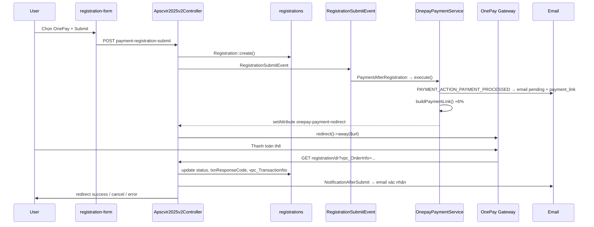

# Thanh toán OnePay — VSIR2026

> Tài liệu tổng hợp cấu hình và luồng **OnePay** trong dự án `vsir2026.websitehoinghi.com`.  
> Liên quan: [`LUONG-DANG-KY-VSIR2026.md`](./LUONG-DANG-KY-VSIR2026.md)

---

## 1. Tổng quan

- Cổng thanh toán: **OnePay VPC 3-Party** (redirect sang trang OnePay)
- Module: `Modules/Payment`
- Form frontend: chọn `payment_method = onepay` → lưu DB là `onepay-payment`
- Phí giao dịch: **+6%** trên số tiền đăng ký (tính khi tạo link thanh toán)
- Sau thanh toán: OnePay redirect về `registration/dr` (callback)

---

## 2. Sơ đồ luồng



---

## 3. Routes

| Method | URL | Route name | Handler |
|--------|-----|------------|---------|
| POST | `payment-registration-submit` | `payment.registration.submit` | Tạo registration + redirect OnePay |
| GET | `registration/dr` | `payment.registration.dr` | Callback OnePay |
| GET | `registration/success` | `registration.successful` | Thanh toán thành công |
| GET | `registration/cancel` | `registration.cancel` | User hủy (code 99) |
| GET | `registration/error` | `registration.error` | Thanh toán thất bại |

**File route:** `Themes/apscvir2025v2/routes/web.php`

---

## 4. Cấu hình merchant OnePay

**File:** `Modules/Payment/Config/config.php`

| Key config | Môi trường | Merchant | URL gateway |
|------------|------------|----------|-------------|
| `domestic` | Nội địa (sandbox) | `ONEPAY` | `https://mtf.onepay.vn/onecomm-pay/vpc.op` |
| `international_test` | Test quốc tế | `TESTONEPAY33` | `https://mtf.onepay.vn/paygate/vpcpay.op` |
| `international` | Production USD | `HOABINHTOUR2` | `https://onepay.vn/vpcpay/vpcpay.op` |
| `international_vnd` | Production VND | `HOABINHTOURIST` | `https://onepay.vn/paygate/vpcpay.op` |

### Merchant đang dùng cho VSIR2026

Logic chọn merchant trong `OnepayPaymentService`:

```php
$currentLocale = session('frontend-locale', app()->getLocale());
$accountant = ($currentLocale == 'en') ? 'international' : 'international_vnd';
$onepay = new Onepay($accountant);
```

| Locale session | Config key | Merchant production |
|----------------|------------|---------------------|
| `vi` (mặc định form VN) | `international_vnd` | **HOABINHTOURIST** |
| `en` | `international` | **HOABINHTOUR2** |

> Form đăng ký VSIR2026 hiện chỉ cho **LOCAL / tiếng Việt** → thực tế dùng **`international_vnd` / HOABINHTOURIST**.

### Thông tin merchant `international_vnd` (production VND)

```
vpc_Merchant   : HOABINHTOURIST
vpc_AccessCode : C0904D34
vpc_SecureHash : 0C01C23126F9EBEF588B46FCB02F0B72  (HMAC secret)
vpc_url        : https://onepay.vn/paygate/vpcpay.op
```

### Thông tin merchant `international` (production USD)

```
vpc_Merchant   : HOABINHTOUR2
vpc_AccessCode : 7763F5C5
vpc_SecureHash : E89978A34FCD1E64B44DB6F063068771
vpc_url        : https://onepay.vn/vpcpay/vpcpay.op
```

### Sandbox test

```
international_test → TESTONEPAY33 @ mtf.onepay.vn
domestic           → ONEPAY @ mtf.onepay.vn (ít dùng trong luồng hiện tại)
```

**Lưu ý bảo mật:** Secret hash nằm trong file config repo — khi port sang dự án mới nên chuyển vào `.env`.

---

## 5. Enum & constants

**File:** `Modules/Payment/Enums/PaymentMethodEnum.php`

| Constant | Giá trị | Ý nghĩa |
|----------|---------|---------|
| `ONEPAY_PAYMENT` | `onepay-payment` | Giá trị lưu DB `payment_method` |
| `ONEPAY_PAYMENT_REDIRECT` | `onepay-payment-redirect` | Attribute tạm chứa URL redirect |
| `ONEPAY_PAYMENT_FEEDBACK` | `onepay-payment-feedback` | Key route redirect sau callback |

**File:** `Modules/Payment/Helpers/constants.php`

```php
define('ONEPAY_PAYMENT_METHOD_NAME', 'onepay-payment');
define('PAYMENT_ACTION_PAYMENT_PROCESSED', 'payment-action-payment-processed');
```

---

## 6. Form frontend → backend

**View:** `Themes/apscvir2025v2/views/registration-form.blade.php`

```html
<input type="radio" name="payment_method" value="onepay" required>
Thanh toán online (Visa, MasterCard, JCB, Amex) — 6% phí giao dịch
```

**Controller map** (`Apscvir2025v2Controller@paymentRegistrationSubmit`):

```php
if ($request->payment_method === 'onepay') {
    $data['payment_method'] = PaymentMethodEnum::ONEPAY_PAYMENT; // 'onepay-payment'
}
```

---

## 7. Luồng code chi tiết

### 7.1. Sau submit form

```
paymentRegistrationSubmit()
  → Registration::create()
  → event(RegistrationSubmitEvent)
    → PaymentAfterRegistration::handle()
      → OnepayPaymentService::execute($registration)
```

### 7.2. `OnepayPaymentService::execute`

**File:** `Modules/Payment/Services/OnepayPaymentService.php`

```php
public function execute($data)
{
    $chargeId = Str::upper(Str::random(10));
    do_action(PAYMENT_ACTION_PAYMENT_PROCESSED, $data);  // → gửi email
    $this->handleBeforePaymentPageRedirect($data);
    return $chargeId;
}
```

### 7.3. Tạo link thanh toán

```php
$url = $onepay->buildPaymentLink(
    $registration->guest_code,              // vpc_OrderInfo  VD: VSIR2026-001
    $registration->guest_code . '_' . time(), // vpc_MerchTxnRef (unique)
    $registration->total * 1.06,            // amount + 6%
    route('payment.registration.dr')       // vpc_ReturnURL
);
$registration->setAttribute('onepay-payment-redirect', $url);
```

### 7.4. Redirect user

```php
if ($redirect = $registration->getAttribute(PaymentMethodEnum::ONEPAY_PAYMENT_REDIRECT)) {
    return redirect()->away($redirect);
}
```

### 7.5. Callback OnePay

**File:** `Themes/apscvir2025v2/src/Http/Controllers/Apscvir2025v2Controller.php`

```php
protected function handleRegistrationResponse(OnepayPaymentService $onepayPaymentService)
{
    $payloadResponse = $onepayPaymentService->handleResponse($_REQUEST);

    $registration = Registration::where('guest_code', $_REQUEST['vpc_OrderInfo'])->first();

    if ($registration) {
        $registration->update([
            'orderinfo'         => $_REQUEST['vpc_OrderInfo'],
            'txnResponseCode'   => $_REQUEST['vpc_TxnResponseCode'],
            'vpc_TransactionNo' => $_REQUEST['vpc_TransactionNo'] ?? null,
            'status'            => $payloadResponse['status'],
        ]);
    }

    event(new NotificationAfterSubmit($registration));
    return redirect()->route($payloadResponse['onepay-payment-feedback']);
}
```

---

## 8. Thư viện `Onepay` — build URL & verify

**File:** `Modules/Payment/Libraries/Onepay.php`

### 8.1. Tham số gửi OnePay

| Param | Nguồn | Ví dụ |
|-------|-------|-------|
| `vpc_Merchant` | config | `HOABINHTOURIST` |
| `vpc_AccessCode` | config | `C0904D34` |
| `vpc_OrderInfo` | `guest_code` | `VSIR2026-001` |
| `vpc_MerchTxnRef` | `guest_code_timestamp` | `VSIR2026-001_1719398400` |
| `vpc_Amount` | `total * 1.06 * 100` | 2.500.000 → `265000000` |
| `vpc_ReturnURL` | route callback | `https://domain/registration/dr` |
| `vpc_Command` | cố định | `pay` |
| `vpc_Version` | cố định | `2` |
| `vpc_Locale` | cố định | `vn` |

**Quan trọng:** `vpc_Amount` = số tiền × **100** (OnePay quy ước, đơn vị nhỏ nhất).

### 8.2. Secure hash

- Thuật toán: **HMAC-SHA256**
- Sort params `ksort`, chỉ hash các key bắt đầu `vpc_` hoặc `user_`
- Append `vpc_SecureHash` vào URL

```php
hash_hmac('SHA256', $md5HashData, pack('H*', $SECURE_SECRET));
```

### 8.3. Verify callback `getResponseCode()`

1. Lấy `vpc_SecureHash` từ response, bỏ khỏi mảng hash
2. Tính lại HMAC-SHA256
3. So sánh hash → `CORRECT` / `INVALID HASH`
4. Đọc `vpc_TxnResponseCode`

| Điều kiện | Return |
|-----------|--------|
| Hash CORRECT + code `0` | `0` (thành công) |
| Hash INVALID + code `0` | `2` (pending) |
| Khác | trả về `vpc_TxnResponseCode` |

---

## 9. Map mã phản hồi → trạng thái

**File:** `OnepayPaymentService::getPayloadResponse()`

| `vpc_TxnResponseCode` | `status` (DB) | Redirect route | View |
|----------------------|---------------|----------------|------|
| `0` | `successful` | `registration.successful` | `partials/successful.blade.php` |
| `99` | `cancelled` | `registration.cancel` | `partials/cancel.blade.php` |
| Khác | `failed` | `registration.error` | `partials/error.blade.php` |

### Mô tả mã lỗi (admin / export)

**File:** `Onepay::getResponseDescription()`

| Code | Mô tả |
|------|-------|
| `0` | successful |
| `1` | Bank Declined |
| `2` | pending |
| `3` | Merchant not exist |
| `4` | Invalid access code |
| `5` | Invalid amount |
| `6` | Invalid currency code |
| `7` | Unspecified Failure |
| `8`–`13` | Lỗi thẻ |
| `21` | Insufficient fund |
| `99` | cancelled |

---

## 10. Tính phí 6%

```php
// OnepayPaymentService::getAmount()
return $amount + ($amount * 0.06);
```

| Phí đăng ký (form) | Gửi OnePay | Hiển thị email |
|--------------------|------------|----------------|
| VND 2.500.000 | VND 2.650.000 | `totalTaxFormatted` |
| VND 3.000.000 | VND 3.180.000 | |

Form ghi chú: *"6% phí giao dịch"* trong `registration-form.blade.php`.

Model accessor:

```php
// total + 6% cho email OnePay
public function getTotalTaxFormattedAttribute()
{
    $formatted = number_format($this->total + ($this->total * 0.06), 2);
    return $this->unitByCategory() . $formatted;  // VND2,650,000.00
}
```

---

## 11. Cột DB lưu thông tin OnePay

Bảng `registrations`:

| Cột | Nội dung |
|-----|----------|
| `payment_method` | `onepay-payment` |
| `guest_code` | = `vpc_OrderInfo` |
| `total` | Phí gốc (chưa +6%) |
| `orderinfo` | `vpc_OrderInfo` (sau callback) |
| `txnResponseCode` | Mã phản hồi OnePay |
| `vpc_TransactionNo` | Mã giao dịch OnePay |
| `status` | `successful` / `cancelled` / `failed` / `pending` |

---

## 12. Email liên quan OnePay

### Khi submit (trước redirect OnePay)

Hook `PAYMENT_ACTION_PAYMENT_PROCESSED` → `NotificationAfterSubmit` → email với:

- Template: `onepay-payment-non-international` (VN) hoặc `onepay-payment` (quốc tế)
- Biến `{payment_link}` = URL OnePay vừa tạo
- `{total}` = `totalTaxFormatted` (đã +6%)

### Sau callback thành công

`handleRegistrationResponse` → `NotificationAfterSubmit` lần 2 (cập nhật trạng thái).

**Cấu hình email:** `Modules/Registration/Config/config.php` + template trong Admin Settings.

---

## 13. File tham chiếu

```
Modules/Payment/
├── Config/config.php                    # Merchant, AccessCode, SecureHash, URL
├── Enums/PaymentMethodEnum.php
├── Helpers/constants.php
├── Libraries/Onepay.php                 # buildPaymentLink, getResponseCode
├── Services/OnepayPaymentService.php    # execute, handleResponse
├── Listeners/RegisterOnepayPaymentMethod.php
└── Providers/PaymentServiceProvider.php

Modules/Registration/
├── Listeners/PaymentAfterRegistration.php
└── Providers/RegistrationServiceProvider.php  # hook PAYMENT_ACTION_PAYMENT_PROCESSED

Themes/apscvir2025v2/
├── routes/web.php                       # submit + callback routes
├── src/Http/Controllers/Apscvir2025v2Controller.php
└── views/
    ├── registration-form.blade.php      # chọn onepay
    └── partials/
        ├── successful.blade.php
        ├── cancel.blade.php
        └── error.blade.php
```

---

## 14. Checklist port sang dự án khác

- [ ] Copy `Modules/Payment` (Onepay library + service + config)
- [ ] Đăng ký routes: submit POST + callback GET `registration/dr`
- [ ] Cấu hình merchant OnePay (AccessCode, SecureHash) — nên dùng `.env`
- [ ] Đăng ký **Return URL** với OnePay = `https://{domain}/registration/dr`
- [ ] Map form `onepay` → `onepay-payment` trong controller
- [ ] Đảm bảo `guest_code` unique — dùng làm `vpc_OrderInfo`
- [ ] Tính `vpc_Amount = (total * 1.06) * 100`
- [ ] Callback không cần CSRF (GET từ OnePay)
- [ ] Cấu hình template email `onepay-payment-non-international`
- [ ] Test sandbox `international_test` trước khi lên production

---

## 15. Route test email OnePay (dev only)

**File:** `Themes/apscvir2025v2/routes/web.php`

| URL | Mô tả |
|-----|-------|
| `/test-send-email` | Test qua event với payment_link OnePay mẫu |
| `/test-send-email-direct` | Gửi trực tiếp template `onepay-payment` |
| `/test-send-email-vi` | Test email tiếng Việt |
| `/test-send-email-en` | Test email tiếng Anh |

Tất cả gửi test tới `minhphamquang028@gmail.com`.

---

## 16. Ví dụ tính tiền

**Đăng ký Bác sĩ VSIR — VND 2.500.000:**

```
total (DB)           = 2,500,000
amount gửi OnePay    = 2,500,000 × 1.06 = 2,650,000
vpc_Amount (param)   = 2,650,000 × 100 = 265,000,000
vpc_OrderInfo        = VSIR2026-001
vpc_MerchTxnRef      = VSIR2026-001_1719398400
vpc_ReturnURL        = https://vsir2026.websitehoinghi.com/registration/dr
```

---

## 17. Ghi chú kỹ thuật

1. **`paymentByMerchant` dùng locale session**, không dùng `is_international` — cần đồng bộ locale khi callback.
2. **`setAttribute` redirect URL** không lưu DB — chỉ dùng trong cùng request.
3. **Email gửi 2 lần** với OnePay: lúc submit (có link) và lúc callback (cập nhật status).
4. **Admin export/table** dùng `Onepay('international')` để decode `txnResponseCode` — có thể không khớp merchant VND.
5. Config `domestic` / `international_test` có sẵn nhưng luồng VSIR2026 mặc định chọn `international_vnd`.
6. Secret hash trong repo — **không commit** khi public; chuyển sang env khi deploy mới.

---

*Tài liệu OnePay — cập nhật: 26/06/2026*
